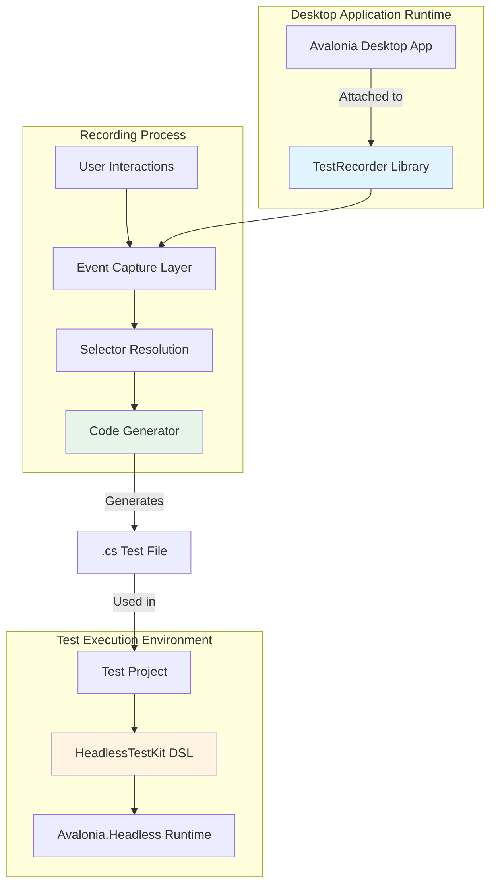
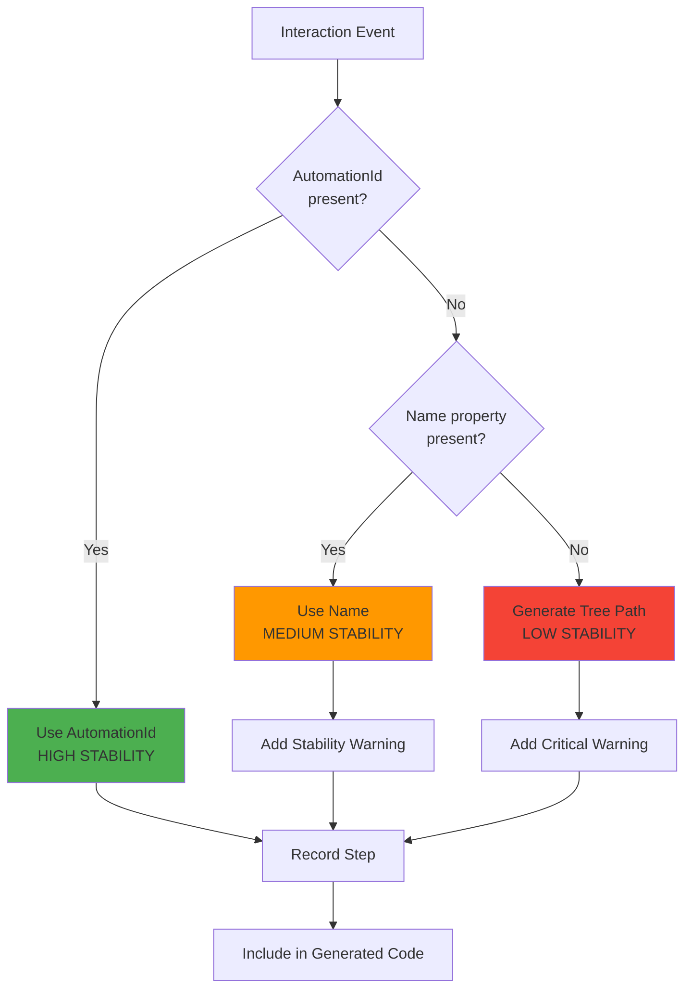
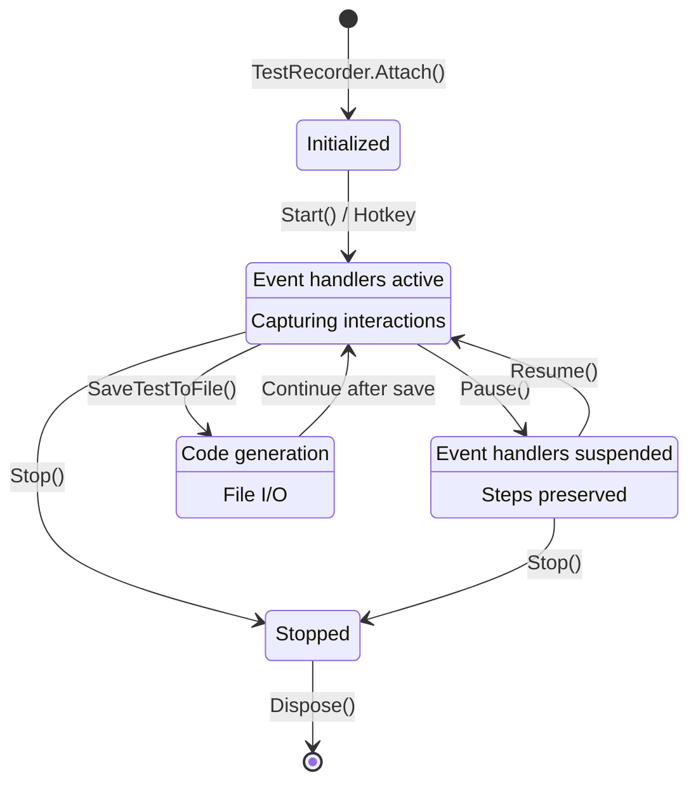
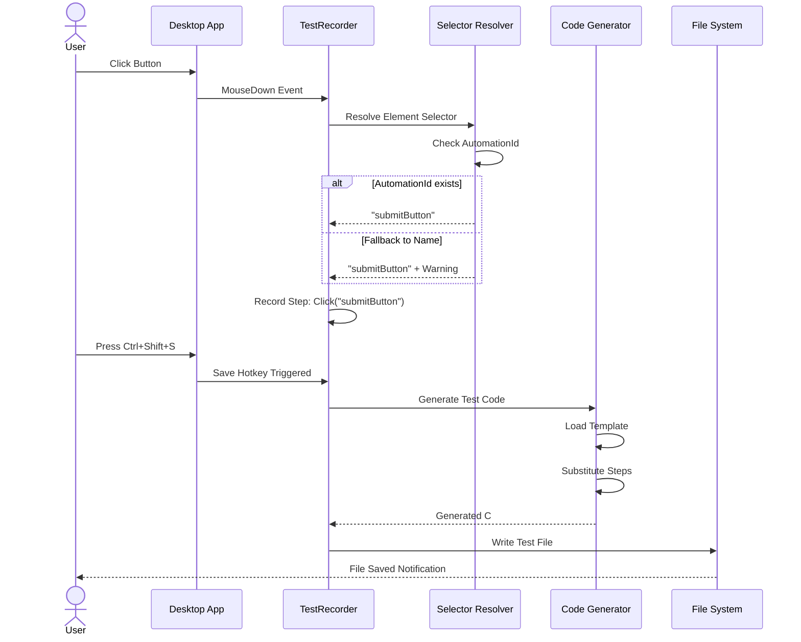
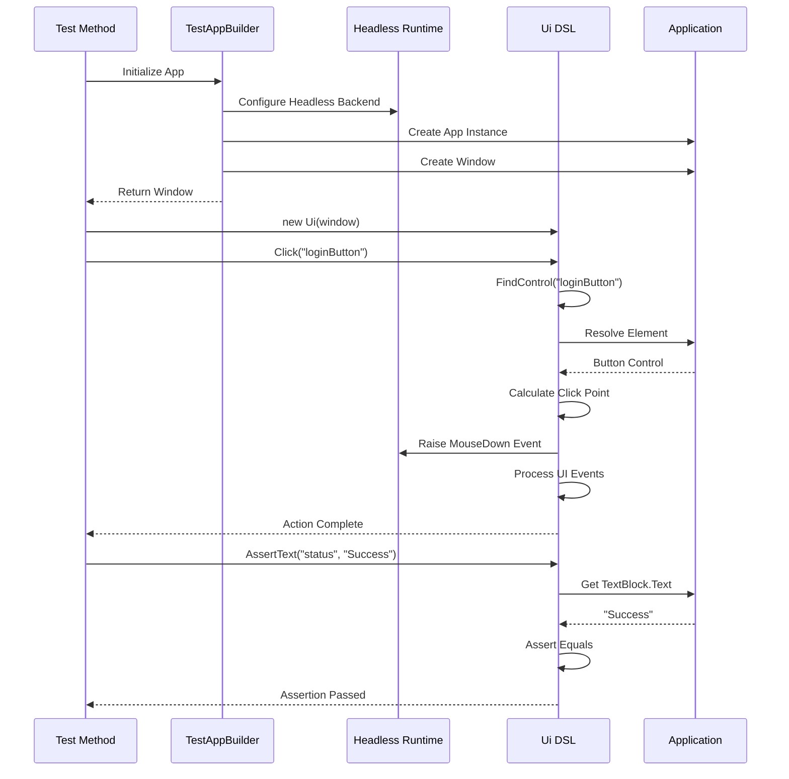

# Design Document: Avalonia Test Recorder & Code Generation System

## Document Information

- **Feature**: Desktop Avalonia UI Test Recorder with Headless Test Code Generation
- **Version**: 1.0
- **Last Updated**: 2024
- **Status**: Draft

## Problem Statement

Manual creation of Avalonia.Headless tests requires significant effort: developers must inspect UI element hierarchies, determine correct selectors, write boilerplate setup code, and maintain synchronization logic. This creates a barrier to comprehensive UI test coverage and slows down the testing workflow.

## Solution Vision

A two-component toolchain that enables developers to record user interactions in a running Avalonia desktop application and automatically generate executable, maintainable C# headless test code. The system bridges the gap between manual UI exploration and automated testing by capturing user actions and translating them into stable, reproducible test scenarios.

## Goals and Non-Goals

### Goals

- Enable recording of user interactions (clicks, text input, scrolling, keyboard actions) in live Avalonia desktop applications
- Generate readable, maintainable C# test code compatible with Avalonia.Headless
- Provide stable element identification through AutomationId-based selectors with intelligent fallbacks
- Support assertion capture for validating UI state during test execution
- Deliver developer-friendly DSL helpers that abstract headless test complexity
- Create sample artifacts demonstrating end-to-end workflow

### Non-Goals

- Runtime test playback within the desktop application itself (tests execute in headless environment)
- Full UI automation capabilities beyond basic interactions (advanced drag-drop, multi-touch gestures in MVP)
- Cross-platform mobile or web browser recording
- Production runtime overhead when recorder is disabled
- Visual test result dashboards or reporting infrastructure

## System Architecture

### Component Overview

The system consists of four primary artifacts:

1. **Avalonia.TestRecorder** - NuGet library integrated into desktop applications for recording
2. **Avalonia.HeadlessTestKit** - NuGet library providing DSL helpers for test projects
3. **SampleApp** - Reference Avalonia desktop application with recorder integration
4. **SampleApp.Tests.Headless** - Reference test project demonstrating generated tests



## Component 1: Avalonia.TestRecorder (Recording Library)

### Purpose and Scope

A NuGet package that integrates into Avalonia desktop applications to capture user interactions and generate headless test code. Operates as an opt-in development tool with minimal production impact.

### Technical Specifications

**Package Information**
- Package Name: `Avalonia.TestRecorder`
- Target Framework: net8.0 (with optional net7.0 multi-targeting)
- Avalonia Compatibility: 11.x minimum
- Distribution: NuGet package

**Operational Modes**
- Off (default state, zero overhead)
- Recording (active capture of interactions)
- Paused (suspended capture, session preserved)

### Activation Mechanisms

The recorder supports multiple activation pathways to accommodate different developer workflows:

| Activation Method | Use Case | Priority |
|------------------|----------|----------|
| Environment Variable (`AV_RECORDER=1`) | CI/automated scenarios | High |
| Command Line Argument (`--record-tests`) | Explicit session recording | High |
| Programmatic API | Custom integration points | Medium |
| Hotkey Toggle (Ctrl+Shift+R) | Interactive development | Low |
| In-app UI Command | User-friendly access | Optional |

### Hotkey Bindings

Default keyboard shortcuts (configurable through RecorderOptions):

| Hotkey | Action | Description |
|--------|--------|-------------|
| Ctrl+Shift+R | Start/Stop Recording | Toggle recording state |
| Ctrl+Shift+P | Pause/Resume | Suspend without losing session |
| Ctrl+Shift+S | Save Test | Export current session to file |
| Ctrl+Shift+A | Capture Assert | Record assertion for focused/hovered element |
| Esc | Cancel Operation | Abort element selection mode |

### Event Capture Strategy

**Captured Interaction Types**

The recorder monitors and translates the following user actions:

1. **Mouse Clicks**
   - Left click (primary interaction)
   - Right click (context menu scenarios)
   - Double click (activation gestures)
   - Target: Control under pointer at event time

2. **Mouse Movement**
   - Hover events (captured only on explicit command, not continuous tracking)
   - Rational: Avoid noise from incidental pointer movement

3. **Scroll Actions**
   - Mouse wheel delta events
   - Scroll offset changes on ScrollViewer controls
   - Preserve direction and magnitude

4. **Text Input**
   - TextInput events (character insertion)
   - Sequential characters coalesced into single TypeText step
   - Debouncing strategy: 500ms idle threshold

5. **Keyboard Commands**
   - Non-text keys recorded as discrete steps: Enter, Tab, Escape, Arrow keys, Backspace, Delete
   - Modifier key combinations preserved (Ctrl, Shift, Alt)

6. **Future Extensions** (not in MVP)
   - Drag and drop operations
   - Selection manipulation
   - Clipboard operations

### Element Identification System

Stable test execution requires reliable element selectors. The recorder employs a prioritized resolution strategy:



**Selector Resolution Priority**

1. **AutomationProperties.AutomationId** (Recommended)
   - Most stable approach
   - Survives layout changes and refactoring
   - Generated code: `ui.Click("loginButton")`

2. **Name Property** (Fallback)
   - Less stable, may conflict or change
   - Generated code: `ui.Click("loginButton") // WARNING: using Name fallback`

3. **Tree Path** (Last Resort)
   - Type-based hierarchical path with index
   - Fragile, breaks with structural changes
   - Generated code: `ui.Click("Window/StackPanel[0]/Button[2]") // WARNING: unstable tree path`

4. **Coordinates** (Diagnostic Only)
   - Recorded but flagged as non-reproducible
   - Not included in generated code by default

**Stability Warnings**

Generated code includes inline comments for non-ideal selectors:
- `// WARNING: fallback selector (Name)` - Consider adding AutomationId
- `// CRITICAL: tree path selector - high risk of breakage` - Requires AutomationId

### Assertion Capture Mechanism

Developers trigger assertion recording via hotkey (Ctrl+Shift+A) or API call. The system:

1. **Identifies Target Control**
   - Primary: Control under mouse cursor
   - Secondary: Currently focused control
   - Configurable priority through RecorderOptions

2. **Extracts Assertion Value**
   - Applies registered IAssertValueExtractor implementations in order
   - First successful extraction used

3. **Records Assert Step**
   - Generates `ui.AssertText(selector, capturedValue)` or similar

**Built-in Value Extractors**

| Control Type | Property Extracted | Generated Method |
|--------------|-------------------|------------------|
| TextBox | Text | AssertText(id, value) |
| TextBlock | Text | AssertText(id, value) |
| ContentControl | Content.ToString() | AssertText(id, value) |
| CheckBox | IsChecked | AssertChecked(id, state) |
| ToggleSwitch | IsChecked | AssertChecked(id, state) |
| Any Control (opt) | IsVisible | AssertVisible(id) |
| Any Control (opt) | IsEnabled | AssertEnabled(id) |

**Extensibility Interface**

Applications can register custom extractors:

Interface contract (conceptual):
- Method: bool TryExtract(Control control, out string assertionCode)
- Registration: RecorderOptions.AssertExtractors.Add(new CustomExtractor())
- Use case: Custom controls with specialized state

### Code Generation Engine

**Output Format**

The generator produces structured C# test files:

1. **Test Class Structure**
   - Class name: `Recorded_{ScenarioName}_Tests`
   - Namespace: Derived from application name or configurable
   - Test framework attributes: xUnit `[Fact]` (MVP choice, NUnit optional)

2. **Test Method**
   - Method name: `Scenario_{timestamp}` or `Scenario_{customName}`
   - Signature: `public void Scenario_LoginFlow()`

3. **Test Body Pattern**
   - Window initialization (application-specific setup)
   - DSL helper instantiation: `var ui = new Ui(window);`
   - Sequential action calls: `ui.Click(...)`, `ui.TypeText(...)`, `ui.AssertText(...)`
   - Synchronization points injected automatically

**Template System**

Code templates stored as embedded resources:
- `Templates/xUnit.TestClass.template`
- `Templates/NUnit.TestClass.template` (optional)
- Placeholder substitution: `{ClassName}`, `{TestMethod}`, `{Steps}`

Customization via `RecorderOptions.TemplateProvider` interface:
- Method: string GetTemplate(TemplateType type)
- Allows organization-specific conventions

**Sample Generated Output** (conceptual structure)

```
using Avalonia.Headless.XUnit;
using Xunit;

namespace SampleApp.Tests
{
    public class Recorded_LoginFlow_Tests
    {
        [Fact]
        public void Scenario_LoginFlow()
        {
            // Setup headless window
            var window = // ... app-specific initialization
            var ui = new Ui(window);
            
            // Recorded steps
            ui.Click("usernameField");
            ui.TypeText("usernameField", "testuser");
            ui.Click("passwordField");
            ui.TypeText("passwordField", "password123");
            ui.Click("loginButton");
            
            // Assertions
            ui.AssertText("statusLabel", "Login successful");
        }
    }
}
```

### File Output System

**Save Location Strategy**

| Environment | Default Path | Rationale |
|-------------|--------------|-----------|
| Debug Build | `./RecordedTests` (relative to exe) | Developer convenience |
| Release Build | `%TEMP%/avalonia-recorded-tests` | Avoid pollution |
| Custom | RecorderOptions.OutputDirectory | CI/team conventions |

**File Naming Convention**

Pattern: `{AppName}.{ScenarioName}.{Timestamp}.g.cs`

Components:
- AppName: Assembly name or configured value
- ScenarioName: From RecorderOptions or "Scenario"
- Timestamp: `yyyyMMdd_HHmmss` for uniqueness
- `.g.cs` suffix: Indicates generated file

Example: `SampleApp.LoginFlow.20240315_143022.g.cs`

**Conflict Resolution**

| Mode | Behavior | Use Case |
|------|----------|----------|
| AlwaysNew | Append timestamp, never overwrite | Default, preserves history |
| Overwrite | Replace existing scenario file | Iterative refinement |
| Increment | Add numeric suffix (001, 002...) | Version tracking |

**Auxiliary Outputs**

Optional JSON/YAML step manifest:
- File: `{TestName}.steps.json`
- Purpose: Diffing, regeneration, debugging
- Contains: Raw step data, selector metadata, timestamps

### User Experience Elements

**Visual Feedback Overlay**

Minimal, non-intrusive indicator displayed in application window corner:

Content:
- Recording state indicator (icon + text: "Recording" / "Paused" / "Ready")
- Step counter: "Steps: 12"
- Output file hint: "Saving to: ./RecordedTests/..."

Behavior:
- Auto-hide after 3 seconds of inactivity (configurable)
- Re-appears on state change or new step
- Click to expand mini control panel

Style:
- Semi-transparent background
- Non-modal, non-blocking
- Customizable position (default: top-right)

**Optional Control Panel** (future enhancement)

Expanded UI features:
- Start/Stop/Pause buttons
- Scenario name input field
- Step list with delete/edit
- Save/Copy code buttons

### Configuration API Design

**RecorderOptions Structure** (conceptual schema)

| Property | Type | Default | Purpose |
|----------|------|---------|----------|
| OutputDirectory | string? | null (uses default) | Custom save location |
| ScenarioName | string | "Scenario" | Test naming |
| Hotkeys | RecorderHotkeys | RecorderHotkeys.Default | Keyboard bindings |
| Selector | SelectorOptions | new() | Element identification rules |
| Codegen | CodegenOptions | new() | Template and framework choices |
| AssertExtractors | IList<IAssertValueExtractor> | Built-in set | Custom assertion logic |
| Logger | ILogger? | null | Diagnostic output |

**SelectorOptions Sub-configuration**

| Property | Type | Default | Purpose |
|----------|------|---------|----------|
| PreferName | bool | false | Use Name before tree path |
| AllowTreePath | bool | true | Enable fallback to hierarchy |
| WarnOnFallback | bool | true | Generate warning comments |
| CoordinateLogging | bool | false | Record absolute positions |

**CodegenOptions Sub-configuration**

| Property | Type | Default | Purpose |
|----------|------|---------|----------|
| TestFramework | TestFramework enum | xUnit | Target test framework |
| TemplateProvider | ITemplateProvider? | null | Custom templates |
| Namespace | string? | null (auto-detect) | Generated code namespace |
| IncludeTimestamp | bool | true | Add timestamp to method name |

**Hotkey Configuration**

Hotkey definitions use platform-agnostic key combinations:
- Representation: `KeyGesture` or equivalent
- Conflicts: Automatic detection and warning
- Disable option: Set to null to remove binding

### Public API Contract

**Primary Entry Point**

Static class: TestRecorder

Method: `IRecorderSession Attach(Window window, RecorderOptions? options = null)`

Behavior:
- Attaches event handlers to window and visual tree
- Returns session control interface
- Idempotent: Multiple calls to same window return same session
- Thread-safe: Must be called on UI thread

**Session Control Interface**

IRecorderSession members:

| Member | Purpose | Behavior |
|--------|---------|----------|
| State (property) | Current mode | Returns Off/Recording/Paused |
| Start() | Begin capture | Transitions Off → Recording |
| Stop() | End capture | Transitions Recording/Paused → Off, clears steps |
| Pause() | Suspend capture | Transitions Recording → Paused |
| Resume() | Continue capture | Transitions Paused → Recording |
| SaveTestToFile() | Export to file | Returns string path, throws on IO error |
| ExportTestCode() | Get code text | Returns string (for clipboard), no file IO |
| Dispose() | Cleanup | Detaches handlers, stops recording |

**Lifecycle Pattern**

Expected usage:

1. Application startup checks activation conditions
2. If recording enabled: `var session = TestRecorder.Attach(mainWindow, options)`
3. User interacts with application
4. User triggers save: `session.SaveTestToFile()` or hotkey
5. Application shutdown: session.Dispose() (or using statement)

### Security and Privacy Considerations

**Sensitive Data Protection**

Password fields require special handling:
- Detection: Controls with Type=Password or class PasswordBox
- Behavior: Text input recorded as placeholder
- Generated code: `ui.TypeSecret("passwordField", "<redacted>")` or `ui.TypeText("passwordField", "TEST_PASSWORD")`
- Configuration: RecorderOptions.RedactedControlTypes (extensible list)

**Production Safety**

Recommended integration pattern:
- Conditional compilation: `#if DEBUG` wrapper
- Explicit opt-in: Require environment variable AND debug build
- Performance: Zero event handler overhead when Off
- Assembly exclusion: Mark InternalsVisibleTo for test projects only

### Performance Characteristics

**Event Processing Overhead**

- Inactive state: Zero performance impact (no handlers attached)
- Recording state: Event handlers execute on UI thread
  - Mouse events: Selector resolution deferred to separate queue
  - Text input: Buffered and coalesced every 500ms
  - Expected overhead: < 5ms per interaction

**Memory Footprint**

- Step storage: In-memory list, approximately 200 bytes per step
- Typical session: 50-100 steps = ~20KB
- No background threads or timers during idle periods

**Thread Safety Model**

- All recording logic runs on UI thread (Avalonia dispatcher)
- No cross-thread synchronization needed for event capture
- File I/O operations on background thread (during save)
- Session state changes: atomic transitions with property notification

### Logging and Diagnostics

**Integration Points**

Logger interface: Microsoft.Extensions.Logging.ILogger

Configuration: RecorderOptions.Logger property

Log levels:
- Trace: Individual event captures
- Debug: Selector resolution details
- Information: Session start/stop, file save operations
- Warning: Fallback selectors, missing AutomationId
- Error: File I/O failures, template rendering errors

**Auxiliary Log File**

Optional file output: `{TestName}.recorder.log`
- Location: Same directory as generated test
- Content: Full diagnostic trace of recording session
- Purpose: Troubleshooting selector issues, step debugging

## Component 2: Avalonia.HeadlessTestKit (Test Helper Library)

### Purpose and Scope

A NuGet package providing DSL abstractions and utility methods for writing Avalonia.Headless tests. Reduces boilerplate, improves test readability, and encapsulates synchronization patterns.

### Technical Specifications

**Package Information**
- Package Name: `Avalonia.HeadlessTestKit`
- Target Framework: net8.0
- Dependencies: Avalonia.Headless, Avalonia.Headless.XUnit (or NUnit variant)
- Distribution: NuGet package

### Core DSL Class: Ui

**Purpose**

Provides fluent, intention-revealing methods for interacting with headless UI. Abstracts away coordinate calculations, input routing, and synchronization.

**Instantiation**

Constructor signature (conceptual): `Ui(Window window)` or `Ui(TopLevel topLevel)`

Lifecycle: One instance per test, tied to application window

**Interaction Methods**

Fundamental operations:

| Method | Parameters | Behavior |
|--------|-----------|----------|
| Click | id (string) | Left mouse click at element center |
| RightClick | id (string) | Right mouse click for context menu |
| DoubleClick | id (string) | Double-click gesture |
| Hover | id (string) | Move pointer over element (triggers hover states) |
| Scroll | id (string), delta (Vector) | Mouse wheel scroll on target |
| TypeText | id (string), text (string) | Focus + character input sequence |
| KeyPress | key (PhysicalKey), modifiers (KeyModifiers) | Single key with modifiers |
| KeyChord | keys (params PhysicalKey[]) | Sequential key presses |

**Assertion Methods**

| Method | Parameters | Behavior |
|--------|-----------|----------|
| AssertText | id, expected (string) | Verify text content equals expected |
| AssertVisible | id | Verify IsVisible = true |
| AssertEnabled | id | Verify IsEnabled = true |
| AssertChecked | id, expected (bool?) | Verify toggle state |

**Synchronization Methods**

Critical for stable headless tests:

| Method | Parameters | Behavior |
|--------|-----------|----------|
| WaitFor | id, condition (Func<Control, bool>), timeout (TimeSpan) | Poll until condition met or timeout |
| WaitForText | id, expected (string), timeout | Convenience wrapper for text equality |
| WaitForVisible | id, timeout | Convenience wrapper for visibility |
| WaitForEnabled | id, timeout | Convenience wrapper for enabled state |

**Implicit Synchronization**

All interaction and assertion methods automatically:
1. Execute pending UI dispatcher jobs
2. Process layout pass
3. Render frame (if needed)
4. Apply short settle delay (configurable, default 10ms)

Rationale: Eliminates flaky tests caused by async rendering or animations

### Element Resolution Strategy

**FindControl Implementation**

Logic flow:

1. **AutomationId Search**
   - Traverse visual tree depth-first
   - Match `AutomationProperties.AutomationId` property
   - Return first match

2. **Name Property Search** (if AutomationId not found)
   - Search for `Name` property match
   - Log warning about fallback

3. **Tree Path Resolution** (if previous methods fail)
   - Parse path syntax: `ParentType/ChildType[index]/TargetType[index]`
   - Navigate hierarchy based on type and position
   - Highly fragile, diagnostic logging

4. **Error Handling**
   - Throw ControlNotFoundException with diagnostic message
   - Include: search ID, tree structure snapshot, available AutomationIds

**Interaction Point Calculation**

For click/hover operations:

1. Retrieve control `Bounds` property
2. Calculate center point: (Bounds.Width / 2, Bounds.Height / 2)
3. Translate to window coordinates using `TranslatePoint`
4. Route input event to calculated position

Edge cases:
- Zero-sized controls: Use (1, 1) offset with warning
- Clipped controls: Verify visibility before interaction
- Overlapping controls: Use z-index aware hit testing

### Synchronization Mechanisms

**Post-Action Processing**

After every interaction method:

1. Flush Avalonia dispatcher queue
2. Trigger layout pass (`UpdateLayout` equivalent)
3. Process render operations
4. Optional: Wait for animations (configurable)
5. Thread sleep: 10-50ms configurable settle time

**WaitFor Implementation Pattern**

Polling loop structure:

1. Start timeout timer
2. Loop until condition met or timeout:
   - Find control
   - Evaluate condition function
   - If true: return success
   - If false: process dispatcher, sleep 50ms, retry
3. On timeout: throw TimeoutException with diagnostic info

**Async Scenario Support**

For operations that trigger background work:

- `WaitForText(id, expectedValue, timeout: 5s)` - Wait for async update
- `WaitFor(id, c => c.IsEnabled, timeout: 3s)` - Wait for button enabled after operation
- `WaitForVisible(id, timeout: 2s)` - Wait for popup/dialog appearance

Design principle: Make async waits explicit and visible in test code

### Test Framework Integration

**Initialization Pattern**

Headless platform setup required before any tests:

Phase 1: AppBuilder configuration
- Use `AppBuilder.Configure<App>().UseHeadless(...)`
- Register headless rendering backend
- Configure test-specific services

Phase 2: Window creation
- Instantiate application
- Create main window
- Show window (headless context)

**xUnit Integration**

Recommended pattern:
- Use `Avalonia.Headless.XUnit` package
- Attribute: `[AvaloniaFact]` or `[AvaloniaTheory]`
- Fixture: Shared app initialization via `IClassFixture<>` if needed

**NUnit Integration** (optional)

Pattern:
- Manual initialization in `[SetUp]` or `[OneTimeSetUp]`
- Headless platform registration in test fixture
- Window disposal in `[TearDown]`

### Extension Points

**Custom Interaction Methods**

UI class designed for inheritance:
- Protected helper: `FindControl(id)` exposed for subclasses
- Protected helper: `ProcessUiEvents()` for custom synchronization
- Example: `MyUi : Ui` with domain-specific methods like `LoginAs(username)`

**Custom Assertions**

Pattern: Extension methods on Ui class
- Namespace convention: `{AppName}.TestExtensions`
- Example: `ui.AssertDataGridRowCount(id, expected)`

## Component 3: SampleApp (Reference Desktop Application)

### Purpose and Scope

Demonstration Avalonia desktop application that showcases recorder integration and provides realistic test scenarios. Serves as reference implementation for library consumers.

### Project Structure

Location: `samples/SampleApp`

Project type: Avalonia MVVM Desktop Application

Target framework: net8.0

Key files:
- `App.axaml` / `App.axaml.cs` - Application entry point, recorder initialization
- `MainWindow.axaml` / `MainWindow.axaml.cs` - Primary window with recorder attachment
- `ViewModels/` - MVVM view models
- `Views/` - User controls and views
- `RecorderIntegration.cs` - Recorder setup logic

### Demonstration Scenarios

**Scenario 1: Login Form**

Components:
- Username TextBox (AutomationId: "usernameField")
- Password TextBox (AutomationId: "passwordField")
- Login Button (AutomationId: "loginButton")
- Status TextBlock (AutomationId: "statusLabel")

User flow:
1. Click username field
2. Type username
3. Click password field
4. Type password
5. Click login button
6. Assert status text changes to "Login successful"

Recording output: Login test with text input and assertion

**Scenario 2: Scrollable List**

Components:
- ListBox with 50+ items (AutomationId: "itemList")
- ScrollViewer
- Item template with selectable elements

User flow:
1. Scroll down in list
2. Click specific item
3. Assert item details displayed

Recording output: Scroll and click test

**Scenario 3: Hover and Tooltip**

Components:
- Button with tooltip (AutomationId: "helpButton")
- Tooltip content
- Info panel (AutomationId: "infoPanel")

User flow:
1. Hover over button
2. Capture assert on tooltip content (via explicit hotkey)
3. Click button
4. Assert info panel text

Recording output: Hover action with captured assertion

### AutomationId Conventions

All interactive controls MUST have AutomationId set:

```
Button AutomationProperties.AutomationId="actionName_Button"
TextBox AutomationProperties.AutomationId="fieldName_TextBox"
ListBox AutomationProperties.AutomationId="listName_ListBox"
```

Naming pattern: `{semanticName}_{ControlType}` (snake_case or camelCase)

Documentation: `docs/conventions-automationid.md` with guidelines

### Recorder Integration Logic

**Initialization Hook**

Location: `App.axaml.cs` OnFrameworkInitializationCompleted override

Logic:
1. Check activation conditions:
   - Environment variable: `Environment.GetEnvironmentVariable("AV_RECORDER")`
   - Command line: `args.Contains("--record-tests")`
   - Build configuration: `#if DEBUG` conditional
2. If any condition true:
   - Obtain MainWindow reference
   - Configure RecorderOptions
   - Call `TestRecorder.Attach(mainWindow, options)`
3. Store session reference for lifetime management

**Configuration**

RecorderOptions setup:
- OutputDirectory: `./RecordedTests` (relative to exe)
- ScenarioName: User-provided via optional input or default "Scenario"
- Hotkeys: Default bindings
- AssertExtractors: Built-in set
- Logger: Console logger with Debug level

**UI Feedback**

Recorder overlay displayed in MainWindow:
- Position: Top-right corner
- Content: "Recording: {stepCount} steps | Output: {filename}"
- Visibility: Bound to recorder state

### User Documentation

Included README sections:

1. **Quick Start**
   - How to run with recording enabled
   - Hotkey reference
   - Where to find generated tests

2. **Recording Workflow**
   - Step-by-step recording process
   - Capturing assertions
   - Saving and exporting tests

3. **AutomationId Guidelines**
   - Why AutomationId matters
   - Naming conventions
   - How to add to existing controls

4. **Generated Test Integration**
   - Copying test to test project
   - Adjusting namespaces
   - Running headless tests

## Component 4: SampleApp.Tests.Headless (Reference Test Project)

### Purpose and Scope

Demonstration test project that consumes generated tests and showcases HeadlessTestKit usage. Provides templates for developers to adapt to their own applications.

### Project Structure

Location: `samples/SampleApp.Tests.Headless`

Project type: xUnit test project (or NUnit if chosen)

Target framework: net8.0

Dependencies:
- Avalonia.Headless
- Avalonia.Headless.XUnit (or NUnit variant)
- Avalonia.HeadlessTestKit (Component 2)
- SampleApp project reference

Key files:
- `TestAppBuilder.cs` - Headless application initialization helper
- `Generated/` - Folder for recorder-generated test files
- `Manual/` - Hand-written test examples
- `Extensions/` - Custom DSL extensions (if any)

### Headless Platform Initialization

**TestAppBuilder Pattern**

Utility class providing reusable initialization:

Responsibilities:
- Configure AppBuilder with headless backend
- Register test-specific services (mocks, test data)
- Create and return application instance
- Create and show main window

Usage pattern in tests:

```
Conceptual usage (not actual code):
- Obtain application instance
- Obtain main window
- Create Ui helper instance
- Execute test steps
- Cleanup
```

**Fixture Strategy**

For expensive initialization:
- xUnit: `IClassFixture<AppFixture>` for shared app instance
- NUnit: `[OneTimeSetUp]` in base test class

Rationale: Headless app initialization can be costly (100-500ms)

### Sample Test Scenarios

**Test 1: Generated Login Test**

File: `Generated/Recorded_LoginFlow_20240315_143022.g.cs`

Content: Exact output from recorder:
- Click username field
- Type "testuser"
- Click password field  
- Type "password123"
- Click login button
- Assert status text equals "Login successful"

Purpose: Demonstrate zero-modification generated test execution

**Test 2: Enhanced Generated Test**

File: `Manual/LoginFlow_Enhanced.cs`

Content: Generated test with manual improvements:
- Parameterized test (Theory/TestCase)
- Multiple username/password combinations
- Additional assertions on UI state
- Custom wait conditions

Purpose: Show how to evolve generated tests

**Test 3: Async UI Update Test**

File: `Manual/AsyncSearchTest.cs`

Scenario:
- Type in search box
- Wait for search results (async operation)
- Assert result count

Key methods used:
- `ui.TypeText("searchBox", "query")`
- `ui.WaitForText("resultCount", "5 results", timeout: 3s)`
- `ui.AssertVisible("resultList")`

Purpose: Demonstrate WaitFor synchronization patterns

### Test Execution

**Local Development**

Command: `dotnet test`

Output: Standard xUnit/NUnit test results

Performance: Each test ~500ms-2s depending on scenario complexity

**Continuous Integration**

CI compatibility:
- No display server required
- Headless rendering backend
- Linux/Windows/macOS compatible

Sample CI configuration (conceptual):
- Checkout code
- Restore NuGet packages
- Build solution
- Run `dotnet test` in test project
- Publish test results

### Custom Extensions Example

File: `Extensions/SampleAppUiExtensions.cs`

Content: Application-specific helper methods

Examples:
- `ui.LoginAs(username, password)` - Encapsulates login flow
- `ui.SelectListItem(listId, itemText)` - Find and click list item by text
- `ui.AssertErrorShown(message)` - Check error notification

Pattern: Extension methods on Ui class

Benefit: DRY principle for common test operations

## Repository Structure

### Recommended Organization

```
/
├── src/
│   ├── Avalonia.TestRecorder/
│   │   ├── Avalonia.TestRecorder.csproj
│   │   ├── TestRecorder.cs (main API)
│   │   ├── RecorderSession.cs
│   │   ├── EventCapture/
│   │   │   ├── MouseEventHandler.cs
│   │   │   ├── KeyboardEventHandler.cs
│   │   │   └── TextInputHandler.cs
│   │   ├── Selectors/
│   │   │   ├── SelectorResolver.cs
│   │   │   └── AutomationIdStrategy.cs
│   │   ├── Assertions/
│   │   │   ├── IAssertValueExtractor.cs
│   │   │   └── BuiltInExtractors.cs
│   │   ├── CodeGen/
│   │   │   ├── TestCodeGenerator.cs
│   │   │   └── Templates/ (embedded resources)
│   │   └── UI/
│   │       └── RecorderOverlay.axaml
│   │
│   └── Avalonia.HeadlessTestKit/
│       ├── Avalonia.HeadlessTestKit.csproj
│       ├── Ui.cs (main DSL class)
│       ├── ElementFinder.cs
│       ├── InputSimulator.cs
│       └── SynchronizationHelper.cs
│
├── samples/
│   ├── SampleApp/
│   │   ├── SampleApp.csproj
│   │   ├── App.axaml / App.axaml.cs
│   │   ├── MainWindow.axaml / MainWindow.axaml.cs
│   │   ├── Views/
│   │   │   ├── LoginView.axaml
│   │   │   ├── ListDemoView.axaml
│   │   │   └── TooltipDemoView.axaml
│   │   ├── ViewModels/
│   │   └── RecordedTests/ (output folder)
│   │
│   └── SampleApp.Tests.Headless/
│       ├── SampleApp.Tests.Headless.csproj
│       ├── TestAppBuilder.cs
│       ├── Generated/
│       │   └── (recorder output files copied here)
│       ├── Manual/
│       │   ├── LoginFlow_Enhanced.cs
│       │   └── AsyncSearchTest.cs
│       └── Extensions/
│           └── SampleAppUiExtensions.cs
│
├── docs/
│   ├── recorder-usage.md
│   ├── conventions-automationid.md
│   ├── architecture.md
│   └── troubleshooting.md
│
├── Avalonia.TestRecorder.sln
└── README.md
```

### Solution Configuration

Projects in solution:
1. `src/Avalonia.TestRecorder`
2. `src/Avalonia.HeadlessTestKit`
3. `samples/SampleApp`
4. `samples/SampleApp.Tests.Headless`

Build order:
1. TestRecorder library
2. HeadlessTestKit library
3. SampleApp (references TestRecorder)
4. Test project (references HeadlessTestKit + SampleApp)

## Data Flow and Interaction Diagrams

### Recording Session Lifecycle



### Event Capture to Code Generation Flow



### Headless Test Execution Flow



## Configuration and Customization

### Recorder Configuration Examples

**Minimal Configuration**

Default settings, auto-detect output location:

```
Conceptual API call:
TestRecorder.Attach(mainWindow)
```

**Custom Output Directory**

Explicit save location for team conventions:

```
Conceptual configuration:
- OutputDirectory: "C:/TeamTests/Recorded"
- ScenarioName: "UserJourney"
```

**Extended Assert Extractors**

Adding custom control support:

```
Conceptual pattern:
- Implement IAssertValueExtractor
- Add to RecorderOptions.AssertExtractors
- Extractor checks control type
- Returns assertion code string
```

**Custom Hotkeys**

Changing default keyboard bindings:

```
Conceptual configuration:
- StartStop: Ctrl+Alt+R
- Pause: Ctrl+Alt+P  
- Save: Ctrl+Alt+S
- CaptureAssert: Ctrl+Alt+A
```

### Test Kit Configuration Examples

**Custom Timeout Defaults**

Adjusting wait durations for slow operations:

```
Conceptual Ui configuration:
- DefaultTimeout: 10 seconds (default: 5s)
- SettleDelay: 50ms (default: 10ms)
```

**Custom Element Finder**

Overriding selector resolution:

```
Conceptual pattern:
- Extend Ui class
- Override FindControl method
- Implement custom logic (e.g., data-testid attribute)
```

## Error Handling and Diagnostics

### Recorder Error Scenarios

| Error Condition | Detection | Response | User Notification |
|----------------|-----------|----------|-------------------|
| No AutomationId | Selector resolution | Use fallback + warn | Overlay warning icon |
| File I/O failure | Save operation | Throw IOException | Error dialog with path |
| Template not found | Code generation | Throw InvalidOperationException | Error log + default template |
| Invalid hotkey | Configuration | Log warning | Use default binding |
| Session already attached | Attach() call | Return existing session | No error |

### Test Kit Error Scenarios

| Error Condition | Detection | Response | Diagnostic Info |
|----------------|-----------|----------|----------------|
| Control not found | FindControl() | Throw ControlNotFoundException | Available AutomationIds, tree dump |
| Wait timeout | WaitFor() | Throw TimeoutException | Last control state, condition evaluated |
| Click on invisible control | Click() | Throw InvalidOperationException | Control visibility, bounds |
| Assertion failure | AssertText() | Throw test framework exception | Expected vs actual value |

### Diagnostic Outputs

**Recorder Log Example** (conceptual structure)

```
[INFO] RecorderSession started: ScenarioName=LoginFlow
[DEBUG] MouseDown captured: X=245, Y=134
[DEBUG] Selector resolved: AutomationId="usernameField"
[INFO] Step recorded: Click("usernameField")
[DEBUG] TextInput captured: Text="testuser"
[INFO] Step recorded: TypeText("usernameField", "testuser")
[WARN] Selector fallback: Using Name for Button (AutomationId missing)
[INFO] SaveTestToFile: ./RecordedTests/SampleApp.LoginFlow.20240315_143022.g.cs
```

**Test Execution Log Example** (conceptual structure)

```
[INFO] Ui initialized: Window=MainWindow
[DEBUG] FindControl: AutomationId="usernameField"
[DEBUG] Element found: TextBox at (100,50) size (200x30)
[DEBUG] Click point: (200,65) window coordinates
[DEBUG] MouseDown event raised
[DEBUG] UI events processed: 3 dispatcher jobs
[INFO] Click completed: usernameField
[ERROR] Control not found: AutomationId="nonexistent"
[ERROR] Available AutomationIds: usernameField, passwordField, loginButton
```

## Testing Strategy for the Libraries

### TestRecorder Library Tests

**Unit Tests**

Components to test in isolation:
- Selector resolution logic (AutomationId → Name → TreePath priority)
- Code generation template rendering
- Step recording and coalescing (text input buffering)
- Hotkey binding and conflict detection

**Integration Tests**

End-to-end scenarios:
- Attach to test window, record clicks, generate valid C# code
- Verify generated code compiles
- Test fallback selector warnings appear in output
- Validate file save with various configurations

**Manual Testing**

Using SampleApp:
- Record complete user journeys
- Verify overlay UI updates correctly
- Test hotkey responsiveness
- Validate generated tests execute successfully

### HeadlessTestKit Library Tests

**Unit Tests**

Components:
- Element finder with mock visual trees
- Coordinate calculation logic
- Timeout and polling mechanisms

**Integration Tests**

With real Avalonia headless:
- Click/type/scroll operations on actual controls
- WaitFor timeout behavior
- Assertion failures with correct exceptions
- Synchronization after complex UI updates

## Acceptance Criteria

### AC1: Recorder Integration

**Given**: SampleApp is running with recorder enabled (environment variable or flag)

**When**: User performs the following actions:
1. Click username field
2. Type "testuser"
3. Click password field
4. Type "password123"
5. Click login button
6. Press Ctrl+Shift+A to capture assertion on status label
7. Press Ctrl+Shift+S to save

**Then**:
- Recording overlay shows "7 steps recorded"
- A .cs file is created in configured output directory
- Filename matches pattern: `SampleApp.Scenario.{timestamp}.g.cs`
- File contains valid C# code with xUnit test structure

### AC2: Generated Code Compilation

**Given**: Test file generated from AC1

**When**: File is added to SampleApp.Tests.Headless project

**Then**:
- Project compiles without errors
- Test is discovered by test runner
- No manual code modifications required

### AC3: Headless Test Execution

**Given**: Generated test from AC1 in test project

**When**: `dotnet test` is executed

**Then**:
- Headless application initializes
- All recorded steps execute in sequence
- Assertion on status label passes
- Test completes in < 5 seconds
- Test result is Pass

### AC4: Selector Stability Warnings

**Given**: SampleApp with some controls missing AutomationId

**When**: User records interaction with control that has no AutomationId

**Then**:
- Recorder log shows warning message
- Generated code includes comment: `// WARNING: fallback selector`
- Overlay UI displays warning indicator
- Step is still recorded using Name fallback

### AC5: HeadlessTestKit Usability

**Given**: Developer writes new test manually (not generated)

**When**: Test uses Ui DSL class:
```
Conceptual test code:
- ui.Click("submitButton")
- ui.WaitForText("result", "Success", timeout: 3s)
- ui.AssertVisible("confirmationPanel")
```

**Then**:
- Test executes without manual synchronization code
- WaitFor correctly polls until condition met or timeout
- Assertions provide clear failure messages
- Test is readable and maintainable

### AC6: End-to-End Workflow

**Given**: Clean repository checkout

**When**: Developer follows README instructions:
1. Build solution
2. Run SampleApp with `--record-tests` flag
3. Click through login scenario
4. Save generated test
5. Copy test to test project
6. Run `dotnet test`

**Then**:
- All steps complete without errors
- No manual code editing required
- Test passes on first execution
- Total workflow time < 5 minutes

## Risk Assessment

### Technical Risks

| Risk | Probability | Impact | Mitigation |
|------|------------|--------|------------|
| Selector instability across UI changes | High | High | Emphasize AutomationId in docs, warnings for fallbacks |
| Headless rendering differences from desktop | Medium | Medium | Extensive integration testing, document known limitations |
| Complex controls not supported | Medium | Low | Extensibility points for custom extractors |
| Performance overhead in recording mode | Low | Medium | Lazy initialization, event handler optimization |
| Generated code doesn't compile | Low | High | Template validation, integration tests |

### Usability Risks

| Risk | Probability | Impact | Mitigation |
|------|------------|--------|------------|
| Developers forget to add AutomationId | High | Medium | Clear documentation, warnings in generated code |
| Generated tests too verbose | Medium | Low | DSL helpers keep code concise |
| Hotkey conflicts with application | Low | Low | Configurable hotkeys |
| Unclear where generated files are saved | Medium | Low | Overlay shows output path, prominent in logs |

## Future Enhancements

### Phase 2 Features

**Advanced Interactions**
- Drag and drop recording
- Text selection and clipboard operations
- Multi-touch gestures (if Avalonia supports)

**Code Generation**
- NUnit template support alongside xUnit
- Parameterized test generation from multiple recordings
- Page Object pattern generation for complex UIs

**Recorder UI**
- Full control panel with step editing
- Live preview of generated code
- Step reordering and deletion
- Annotation/comment insertion

**Test Kit**
- Screenshot capture on failure (headless rendering to bitmap)
- Video recording of test execution
- Performance metrics (frame timing, layout passes)

### Community Extensibility

**Plugin System**
- Custom event capture plugins
- Third-party assert extractors
- Alternative code generation templates (e.g., SpecFlow)

**Marketplace Integrations**
- Visual Studio extension for recorder control
- Rider plugin
- CI/CD pipeline templates

## Dependencies

### External Library Requirements

| Component | Dependency | Version | Purpose |
|-----------|-----------|---------|----------|
| TestRecorder | Avalonia | 11.x | UI framework |
| TestRecorder | Microsoft.Extensions.Logging | Latest | Diagnostic logging |
| HeadlessTestKit | Avalonia.Headless | 11.x | Headless rendering |
| HeadlessTestKit | Avalonia.Headless.XUnit | 11.x | Test framework integration |
| SampleApp | Avalonia | 11.x | Desktop application |
| SampleApp.Tests | xUnit | Latest | Test runner |

### Build Requirements

- .NET SDK 8.0 or higher
- NuGet package restore
- No platform-specific build tools required

## Documentation Requirements

### User Documentation

**docs/recorder-usage.md**
- Getting started guide
- Hotkey reference
- Configuration options
- Troubleshooting common issues

**docs/conventions-automationid.md**
- Why AutomationId matters
- Naming conventions and best practices
- How to add to existing applications
- Migration guide for legacy apps

**docs/architecture.md**
- System component overview
- Event capture pipeline
- Code generation architecture
- Extensibility points

### Code Documentation

**XML Documentation Comments**
- All public APIs fully documented
- Example usage in <example> tags
- Parameter descriptions
- Exception conditions

**Sample Code**
- Inline examples in SampleApp
- Multiple test scenarios in test project
- Extension method examples

## Success Metrics

### Adoption Metrics

- NuGet download count
- GitHub stars and forks
- Community test project examples

### Quality Metrics

- Generated test pass rate > 95% on first run
- Selector stability: > 80% use AutomationId (measured via telemetry opt-in)
- Test execution time: < 3s per scenario average

### Developer Experience Metrics

- Time to first recorded test: < 10 minutes from package install
- Documentation clarity: measured via user feedback
- Issue resolution time: < 1 week for critical bugs

## Glossary

**AutomationId**: Avalonia property (AutomationProperties.AutomationId) used to uniquely identify UI elements for testing and accessibility

**Headless Testing**: Running UI tests without visible windows using a virtual rendering backend

**Selector**: String identifier used to locate UI elements in tests (e.g., "loginButton")

**DSL (Domain-Specific Language)**: Specialized API designed for specific problem domain (here: UI testing)

**Tree Path**: Hierarchical identifier based on control types and positions in visual tree

**Coalescing**: Combining multiple similar events into single test step (e.g., character inputs → TypeText)

**Synchronization**: Ensuring UI state is stable before proceeding with test steps

**Fallback Selector**: Less stable identification method used when preferred approach unavailable

## Open Questions

1. **Test Framework Choice**: Finalize xUnit vs NUnit for MVP, or support both from start?
   - Recommendation: xUnit for MVP, NUnit as Phase 2

2. **Password Redaction**: Should redaction be opt-out or opt-in?
   - Recommendation: Opt-out (secure by default)

3. **Step Coalescing**: Should users control text input buffering timeout?
   - Recommendation: Configurable with sensible default (500ms)

4. **Overlay Position**: Should overlay be draggable?
   - Recommendation: Fixed position in MVP, draggable in Phase 2

5. **Multi-Window Support**: How to handle recording across multiple windows?
   - Recommendation: Single window MVP, document limitation

6. **Step Editing**: Should recorder UI allow deleting/reordering steps before save?
   - Recommendation: Not in MVP, record-save-edit in IDE workflow

## Appendix A: Code Template Examples

### xUnit Test Template Structure

```
Template structure (not actual code):
- Using statements (Avalonia namespaces, xUnit, test kit)
- Namespace declaration
- Test class with descriptive name
- Test method with [Fact] attribute
- App initialization block
- Ui DSL instantiation
- Step sequence from recording
- Standard cleanup (if needed)
```

### NUnit Test Template Structure (Optional)

```
Template structure (not actual code):
- Using statements (Avalonia namespaces, NUnit, test kit)
- Namespace declaration  
- Test fixture class with [TestFixture]
- Setup method with [SetUp] for app initialization
- Test method with [Test] attribute
- Ui DSL instantiation
- Step sequence from recording
- Teardown method with [TearDown]
```

## Appendix B: Selector Examples

### High Stability (AutomationId)

```
XAML (conceptual):
Button with AutomationProperties.AutomationId="submitButton"

Generated test code:
ui.Click("submitButton")

Finder logic:
Find control where AutomationProperties.AutomationId == "submitButton"
```

### Medium Stability (Name)

```
XAML (conceptual):
Button with Name="SubmitButton" (no AutomationId)

Generated test code:
ui.Click("SubmitButton") // WARNING: using Name fallback

Finder logic:
Find control where Name == "SubmitButton"
```

### Low Stability (Tree Path)

```
XAML (conceptual):
Button in StackPanel with no AutomationId or Name

Generated test code:
ui.Click("Window/Grid[0]/StackPanel[1]/Button[0]") // CRITICAL: tree path

Finder logic:
Navigate: Window → First Grid → Second StackPanel → First Button
```

## Appendix C: Integration Checklist

For teams adopting the recorder:

- [ ] Install Avalonia.TestRecorder NuGet in desktop app project
- [ ] Add recorder initialization code in App.OnFrameworkInitializationCompleted
- [ ] Audit existing UI for AutomationId coverage (target: > 80%)
- [ ] Add AutomationId to critical user paths
- [ ] Document AutomationId naming conventions for team
- [ ] Create test project with Avalonia.HeadlessTestKit reference
- [ ] Set up TestAppBuilder for headless initialization
- [ ] Record and verify first test scenario
- [ ] Add generated test to source control
- [ ] Configure CI pipeline to run headless tests
- [ ] Train team on recording workflow
- [ ] Establish process for maintaining generated tests
